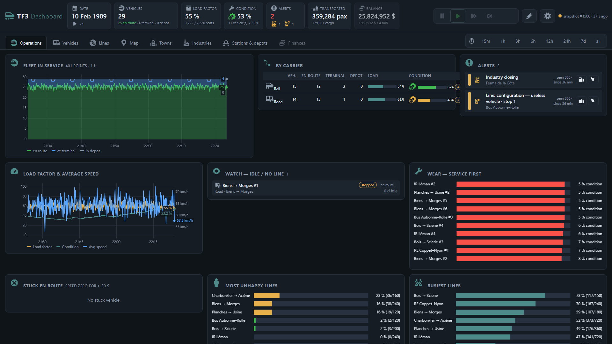

# TF3 Dashboard — Second Screen Dashboard for Transport Fever 3

Turn a second monitor into a live control room for your Transport Fever 3 company: finances, every line and
vehicle, stations, towns, industries, depots and alerts, with the game's own icons and history charts.
Optionally, manage the game from the dashboard (speed, camera, vehicles, stop configuration, terminals) while
the game stays full screen.

Everything runs locally on your PC. Nothing leaves your computer. No account, no installation, no admin rights.

**Get it:** mod [on mod.io](https://mod.io/g/transportfever3/m/second-screen-dashboard) · companion program on the [Releases](https://github.com/M1r077/tf3-dashboard/releases/latest) page.



## How it works

Two halves:

| Part | Where | What it does |
|---|---|---|
| **Mod `Second Screen Dashboard`** | [mod.io](https://mod.io/g/transportfever3/m/second-screen-dashboard) (in-game Mod Hub) or `mod/` in this repo | A Lua game script that writes a snapshot of the game state to `<userdata>/dashboard_export/live.lua` every few seconds, and (if you enable it) executes commands written to `cmd.lua`. Uses only the official TF3 scripting API. Never modifies the savegame. |
| **Companion program (this repo)** | Your PC, Windows | `collector.py` watches `live.lua` / `slow_*.lua` and stores the history in a local SQLite database; `server.py` serves the dashboard at `http://127.0.0.1:8765/` in your browser. Python 3.12 standard library only — the release zip ships a bundled Python, nothing to install. |

The mod alone does nothing visible; the companion alone has nothing to show. mod.io cannot distribute programs,
which is why the companion lives here.

## Install (3 steps)

1. **Mod** — in the game, open the Mod Hub, search *Second Screen Dashboard* ([mod.io page](https://mod.io/g/transportfever3/m/second-screen-dashboard)), subscribe, then enable it in your
   savegame's mod list (like any script mod). Or copy `mod/tf3_dashboard_export` to
   `<Steam>\userdata\<id>\3493540\local\mods\` (see [docs/DETAILS.md](docs/DETAILS.md)).
2. **Companion** — download `TF3-Dashboard-<version>.zip` from the
   [Releases](https://github.com/M1r077/tf3-dashboard/releases) page, unzip anywhere (e.g. `D:\Games\TF3 Dashboard`).
   Mod rev 6+ needs companion 0.2.0+ (the export was split into several files).
3. **Run** — start the game with the mod enabled, then double-click `run_dashboard.cmd`. A window with two panes
   opens (collector | server) and your browser shows the dashboard. Put the browser on your second monitor,
   press `F11`. Close the window to stop everything.

Running from source instead of the release zip: you need Python 3.10+ on the PATH (`winget install Python.Python.3.12`).
No pip, no venv, no packages.

### Remote control (optional)

In the game: Mods ▸ Second Screen Dashboard ▸ **Permit game control = On** (off by default). The dashboard
then shows the game controls (pause / speed, camera, vehicle actions, stop and terminal editor on each line).
Every command does exactly what the matching click in the game does; nothing is ever bought, sold or demolished,
and no route is changed. The channel is a local file (`cmd.lua`) read by the mod four times a second.

## What you see

- **Operations** — fleet in service, load factor and average speed over time, per-carrier summary, stuck or idle
  vehicles, wear (service first), most unhappy and busiest lines, alerts with jump-to-entity.
- **Vehicles** — every vehicle with model icon, line, state, load, speed, condition, history on click. Filter by type.
- **Lines** — load, headway, waiting passengers/cargo, history, and the **stop editor**: load mode, min/max waiting
  time, cargo filter (game icons), preferred and alternative terminals, whole-line actions.
- **Map**, **Towns**, **Industries**, **Stations & depots**, **Finances**.
- Languages: English, French, German — follows the game language automatically.

## Configuration

Nothing to configure in the normal case: the Steam userdata folder and the game installation are detected
automatically (registry + library folders). For Epic/GOG/unusual setups, copy `config.example.json` to `config.json`:

```json
{ "export_dir": "C:\\...\\3493540\\local\\dashboard_export", "game_dir": "C:\\...\\Transport Fever 3", "port": 8765 }
```

Mod settings (in-game): fast interval (time, finances, alerts, vehicles — default 2 s), slow interval (lines,
stations, towns, industries — default 30 s), export vehicles on/off, accept commands on/off, debug log.

## Performance and privacy

- Each snapshot costs a little CPU in the game's script thread; on very large networks increase the intervals or
  disable the vehicle export.
- The database keeps per-snapshot detail for 2 hours and per-minute aggregates for 14 days (configurable, see
  `collector.py --help`). Only the most recent savegame is kept.
- The server listens on `127.0.0.1` only. Commands are refused from any other address.
- The game icons are extracted from **your** game installation at first start (`dashboard/extract_icons.py`); they
  are not redistributed.

## Repository layout

```
collector/      collector.py (live.lua + slow_*.lua -> SQLite), luatable.py (Lua parser), tf3paths.py (folder detection), schema.sql
dashboard/      server.py (HTTP + JSON API), extract_icons.py, static/ (index.html, app.js, i18n.js, style.css)
mod/            the mod as published on mod.io (tf3_dashboard_export) — https://mod.io/g/transportfever3/m/second-screen-dashboard
docs/           DETAILS.md (full technical reference), API_CATALOGUE.md (what the TF3 API allows: done / doable / never)
test/           make_fake_data.py + run_dashboard_demo.cmd (developer tool: simulated data, not in the release zip)
```

## Building a release

`build_release.cmd` downloads the official Python embeddable package, assembles `release/TF3-Dashboard-<version>.zip`
(companion + Python, ~15 MB) and `release/tf3_dashboard_export-rev<N>.zip` (the mod for manual installation).

Two independent version numbers:

- **companion**: `VERSION` in `dashboard/server.py` (shown next to the title in the dashboard). Semver-ish: patch
  (`0.1.x`) for fixes and small adjustments, minor (`0.x.0`) for new features, a new database schema or a dependency
  on a newer mod revision. Every version is a git tag `v<version>` and a GitHub release with its zip, never rebuilt
  afterwards.
- **mod**: `revision` in `mod/tf3_dashboard_export/mod.json`, bumped at each mod.io update only. The
  `tf3_dashboard_export-rev<N>.zip` is attached to a release only when the revision changed.

## License

GPL-3.0 — see [LICENSE](LICENSE). Transport Fever 3 is a trademark of Urban Games; this project is not affiliated
with Urban Games. Game assets are read from your own installation and never redistributed.
